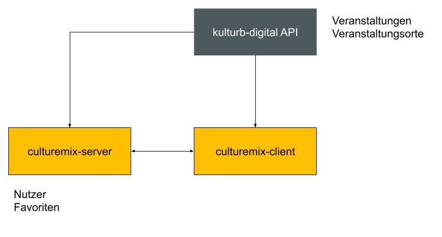

## Table of Contents
1. Setup
2. Architecture overview
3. Development

## 1. Setup
### 1.1 Prerequisites
Ideally, you will use a Unix-based operating system, e.g. macOS or Ubuntu.

For Ionic development, Node.js is required, ideally the LTS which has the major version number 10 at the time of writing.  We recommend using [NVM](https://github.com/creationix/nvm) for easy management of node versions.

List
- Node.js 10.16.3 (LTS)
- npm 6.9.0
- Ionic 4

After setting up Node.js, npm should also be ready. Install Ionic globally

```
npm install -g ionic@4
```

### 1.2 Install project dependencies
Run the following commands in the root directory of the project to install all project dependencies.

```
npm install
```

## 2. Architecture overview


### 2.1 API endpoint
The app connects to a server-side API, swagger docs of the endpoints are available under the /explore endpoint in non-production environments, e.g. here: https://app-staging.example.com/explorer/

### 2.2 Patterns
#### 2.2.1 Data architecture
We strive to use immutable data structures with RxJS.

We use Observables for data that is read-only, such as getting a list of articles. That Observable is updated from the a service only.

We use Promises for operations, e.g. liking an article. The corresponding service must then take care of updating e.g. the article observable to reflect changes.

#### 2.2.2 Modules
We strive to encapsulate functionality into modules with clear responsibility. Those modules can then be used where they are needed.

Modules have a `shared/` folder that most of the time provides a *Service* and a *Module* to be used for interaction, but also templates used by other modules.

#### 2.2.3 Singleton Services
Because we use want immutable states we must take care to only use services as singletons. That's why services from **all** modules are provided by the *CoreModule* and not their respective modules.

*This is crucial for bug free operation*, otherwise some data might not be updated as expected.

### 2.3 File structure
Most relevant folders:
```
src/
	app/
		@core/			# Provide your new services here
		@native/		# Ionic native is provided from here
		@shared/		# Application-wide components
		auth/			# Login, Auth interceptors, etc.
		my-shiny-new-articles/ # New module
		static-pages/	# Imprint, Contact and other pages
		users/			# Registration, Profile, etc.
	assets/	# Static assets like images, videos
	theme/	# Main theme, SASS tooling, application wide styles
```

## 3. Development

### 3.1 Environments
This Ionic project is set up to work with multiple environments, e.g. we have configured different API endpoints for each environment in the `constants.ts`. The default/fallback environment is `development`.

In this project hacking, production and staging are the same. Use production for production builds. development points to the mock server, as pointed out below.

```
# Points to hacking envirnoment, e.g. http://localhost:3000/
npm run start:hacking

# Both point to development environment, e.g. https://app-dev.example.com
npm start
npm run start:development
```

### 3.2 Running and building the project

````
$ npm start                         // start local dev server to use app in the browser (ionic serve)
$ npm run start:hacking             // => APP_ENV=hacking ionic serve
````

Also see `scripts` in `package.json`.